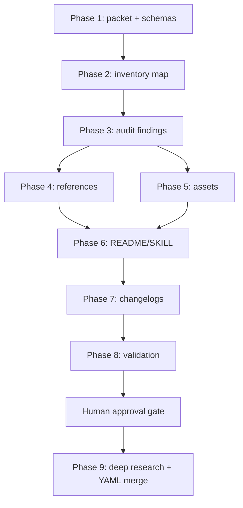

<!-- SPECKIT_TEMPLATE_SOURCE: plan-core | v2.2 -->
<!-- SPECKIT_LEVEL: 3 -->

# Implementation Plan: Deep Skills Reference And Asset Alignment

---

<!-- ANCHOR:summary -->
## 1. SUMMARY

### Technical Context

| Aspect | Value |
|--------|-------|
| **Surface** | OpenCode skill documentation and skill resources |
| **Primary Skills** | `deep-ai-council`, `deep-research`, `deep-review` |
| **Template Owner** | `sk-doc` |
| **Prompt Owner** | `sk-prompt` RCAF + CLEAR |
| **Validation** | sk-doc validators, link sweeps, JSON/YAML parsing, spec validation, skill advisor |

### Overview

The implementation aligns all three deep skills to one resource pattern: README, SKILL router, quick reference, loop protocol, convergence/state references where useful, runtime assets, changelog, and validation evidence. `deep-ai-council` receives the missing reference/asset family, `deep-review` receives focused split references, and `deep-research` receives metadata/version refresh because it was already structurally aligned.
<!-- /ANCHOR:summary -->

---

<!-- ANCHOR:quality-gates -->
## 2. QUALITY GATES

### Definition Of Ready

- [x] Phase folder exists under `000-release-cleanup/013-deep-skills-reference-asset-alignment`.
- [x] User supplied phase plan, assumptions, test plan, and RCAF standard.
- [x] Existing skill inventories inspected before edits.

### Definition Of Done For Phases 1-8

- [x] Level 3 docs, schemas, resource map, audit findings, and validation report exist.
- [x] Skill references/assets are similar in shape and unique in domain language.
- [x] README and SKILL files are updated after resource paths settle.
- [x] Changelogs exist for all touched skills.
- [x] Validation commands pass or failures are documented.
- [x] Phase 9 is blocked pending human approval.
<!-- /ANCHOR:quality-gates -->

---

<!-- ANCHOR:architecture -->
## 3. ARCHITECTURE

### Shared Model

| Resource Family | Council | Research | Review |
|-----------------|---------|----------|--------|
| Quick reference | Council commands and planning stops | Research commands and novelty stops | Review commands and verdict stops |
| Loop protocol | Seats, critique, convergence, persistence | Iterations, reducer, synthesis | Dimensions, findings, reducer, synthesis |
| Convergence | Two-of-three plus critique blockers | Novelty, entropy, graph coverage | Severity-weighted findings and quality gates |
| State | `ai-council-state.jsonl` and report persistence | Research JSONL, strategy, dashboard, synthesis | Review JSONL, registry, dashboard, report |
| Assets | Council config, strategy, dashboard, prompt pack, capability matrix | Existing config, strategy, dashboard, prompt pack, capability matrix | Existing config, strategy, dashboard, prompt pack, contract, capability matrix |

### Boundary

The shared shape is a documentation/resource convention, not a runtime abstraction. Each skill keeps its own vocabulary and stop semantics.
<!-- /ANCHOR:architecture -->

---

<!-- ANCHOR:phases -->
## 4. IMPLEMENTATION PHASES

### Phase 1: Initial Spec Creation

Create the child phase folder, Level 3 docs, schemas, RCAF prompt contract, CLEAR gate, handoffs, and stop-on-failure behavior.

Acceptance criteria:

- Phase folder contains required Level 3 docs plus `description.json` and `graph-metadata.json`.
- Schemas define audit finding, changelog entry, validation report, and iteration output rows.
- Phase 9 review gate is explicit.

### Phase 2: Resource Inventory And Template Map

Inventory scoped artifacts and map each to sk-doc owners:

- `skill_md_template`
- `skill_readme_template`
- `skill_reference_template`
- `skill_asset_template`
- feature catalog template
- manual testing playbook template
- changelog template

Acceptance criteria:

- `resource-map.yaml` rows include all required fields.
- Known facts recorded: `deep-ai-council` had no assets folder; `deep-research` and `deep-review` already had runtime asset families.

### Phase 3: Cross-Skill Audit

Audit usefulness, relevance, correctness, dead links, stale paths, duplicated sibling wording, and sk-doc conformance.

Acceptance criteria:

- `audit-findings.jsonl` exists and conforms to schema.
- Known candidates are verified or rejected with evidence.

### Phase 4: Reference Alignment

Normalize reference families:

- Add council quick reference and loop protocol.
- Keep research split references as canonical.
- Add review focused convergence/state references.

Acceptance criteria:

- Shared document shape is visible.
- Domain vocabulary stays distinct.

### Phase 5: Asset Alignment

Normalize asset families where useful:

- Add council config, strategy, dashboard, prompt-pack, and capability matrix.
- Reuse existing research/review asset families without decorative additions.

Acceptance criteria:

- Council assets support real council workflows.
- No script/YAML behavior is changed.

### Phase 6: README And SKILL Refresh

Refresh human and router docs after resource paths settle.

Acceptance criteria:

- Versions and structure reflect final files.
- Router maps load new resources when relevant.
- Related resources point to real paths.

### Phase 7: Changelog And Versioning

Add changelog entries and bump touched skills:

- `deep-ai-council`: `2.2.0.0`
- `deep-research`: `1.13.0.0`
- `deep-review`: `1.10.1.0`

Acceptance criteria:

- Changelogs separate template alignment, reference changes, asset changes, and router/README updates.

### Phase 8: Validation Gate

Run sk-doc validation, JSON/YAML parsing, link sweeps, strict spec validation, and skill advisor verification.

Acceptance criteria:

- `validation-report.md` and `validation-report.jsonl` capture command evidence.
- Failures block completion or are logged with severity and recommended fix.

### Phase 9: Deep Research And YAML Merge

Blocked until human approval. After approval, run 10 deep-research iterations with saved RCAF prompts and CLEAR scores, then merge only converged missing logic into `resource-map.yaml`.

Acceptance criteria:

- Ten iteration outputs conform to schema.
- Accepted updates are resource-map-only and in scope.
- Rejected speculative/runtime ideas are recorded.
<!-- /ANCHOR:phases -->

---

<!-- ANCHOR:testing -->
## 5. TESTING STRATEGY

| Test Type | Scope | Command |
|-----------|-------|---------|
| Skill package quick validation | All three skills | `python3 .opencode/skills/sk-doc/scripts/quick_validate.py <skill> --json` |
| Document validation | Changed markdown | `python3 .opencode/skills/sk-doc/scripts/validate_document.py <file> --type <type> --blocking-only` |
| Structure extraction | Major rewrites/new refs/assets | `python3 .opencode/skills/sk-doc/scripts/extract_structure.py <file>` |
| JSON parse | New JSON assets/schemas/reports | `jq empty <file>` |
| YAML parse | `resource-map.yaml` | Ruby/Python YAML parse |
| Link sweep | Relative paths in changed files | `rg` path checks |
| Spec validation | Phase packet | `bash .opencode/skills/system-spec-kit/scripts/spec/validate.sh <phase-folder> --strict` |
| Skill routing | Advisor threshold | `skill_advisor.py "<prompt>" --threshold 0.8` |
<!-- /ANCHOR:testing -->

---

<!-- ANCHOR:dependencies -->
## 6. DEPENDENCIES

| Dependency | Type | Status | Impact if Blocked |
|------------|------|--------|-------------------|
| `sk-doc` scripts | Internal | Green | Cannot validate template conformance |
| `sk-prompt` RCAF/CLEAR | Internal | Green | Delegated prompts lack required envelope |
| Human approval | Process | Pending | Phase 9 cannot start |
| Existing skill packages | Internal | Green | Alignment target unavailable if moved |
<!-- /ANCHOR:dependencies -->

---

<!-- ANCHOR:rollback -->
## 7. ROLLBACK PLAN

Rollback is file-scoped. Revert only files touched by this phase if validation shows the alignment harmed routing or doc conformance. Do not revert unrelated dirty worktree changes.
<!-- /ANCHOR:rollback -->

---

<!-- ANCHOR:phase-deps -->
## L2: PHASE DEPENDENCIES

| Phase | Depends On | Blocks |
|-------|------------|--------|
| Initial spec | None | Inventory, audit |
| Inventory | Initial spec | Audit, resource-map |
| Audit | Inventory | Reference and asset alignment |
| References | Audit | README/SKILL refresh |
| Assets | Audit | README/SKILL refresh |
| README/SKILL | References, assets | Changelog, validation |
| Validation | Changelog | Phase 9 approval gate |
| Phase 9 | Human approval | Final resource-map merge |
<!-- /ANCHOR:phase-deps -->

---

<!-- ANCHOR:effort -->
## L2: EFFORT ESTIMATION

| Phase | Complexity | Estimated Effort |
|-------|------------|------------------|
| Phase 1-3 | Medium | Inventory, schemas, audit findings |
| Phase 4-7 | Medium | Resource edits plus README/SKILL/changelog |
| Phase 8 | Medium | Validation and remediation |
| Phase 9 | High | Ten approved research iterations |
<!-- /ANCHOR:effort -->

---

<!-- ANCHOR:enhanced-rollback -->
## L2: ENHANCED ROLLBACK

### Pre-deployment Checklist

- [x] Scope limited to phase packet and three skill packages.
- [x] Runtime scripts/YAML/agents left unchanged.
- [x] Validation report records command results.

### Rollback Procedure

1. Identify the failing changed file from validation evidence.
2. Revert only the corresponding resource/README/SKILL/changelog edit.
3. Re-run the relevant sk-doc and spec validation command.

### Data Reversal

- **Has data migrations?** No.
- **Reversal procedure**: File-level git revert or manual patch for scoped docs/resources only.
<!-- /ANCHOR:enhanced-rollback -->

---

<!-- ANCHOR:dependency-graph -->
## L3: DEPENDENCY GRAPH

<!-- /ANCHOR:dependency-graph -->

---

<!-- ANCHOR:critical-path -->
## L3: CRITICAL PATH

1. Phase packet and schemas.
2. Resource inventory and audit.
3. Council/review resource creation.
4. README/SKILL/changelog refresh.
5. Validation gate.
6. Human approval.
7. Phase 9 deep-research iterations and map merge.
<!-- /ANCHOR:critical-path -->

---

<!-- ANCHOR:milestones -->
## L3: MILESTONES

| Milestone | Scope | Status |
|-----------|-------|--------|
| M1 | Phase packet, schemas, prompts | Complete |
| M2 | References/assets aligned | Complete |
| M3 | README/SKILL/changelogs updated | Complete |
| M4 | Validation gate | Complete |
| M5 | Phase 9 research and YAML merge | Blocked pending approval |
<!-- /ANCHOR:milestones -->
